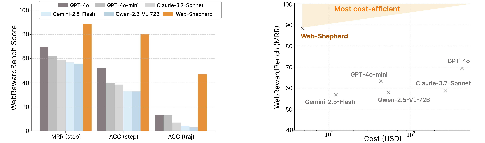
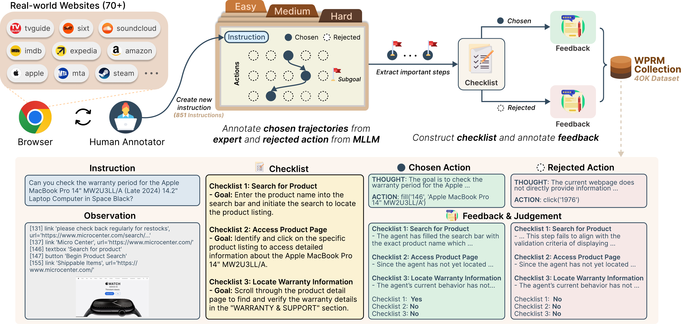

<!-- <p align="left">
  
  <h1 style="font-weight: bold; margin: 0; display: inline-block; vertical-align: middle">Web-Shepherd: Advancing Process Reward Models for Web Agents</h1>
</p> -->
<table>
<tr>
<td></td>
<td><h1 style="margin: 0;">Web-Shepherd: Advancing Process Reward Models for Web Agents</h1></td>
</tr>
</table>


<!-- [](assets/WebShepherd.pdf) -->
<!-- [](assets/WebShepherd.pdf) -->
[](assets/WebShepherd.pdf)
[](https://huggingface.co/collections/LangAGI-Lab/web-shepherd-advancing-prms-for-reinforcing-web-agents-682b4f4ad607fc27c4dc49e8)
[](https://huggingface.co/datasets/LangAGI-Lab/WebPRMCollection_preference_pair)
[](https://demo.web-shepherd.io/)

Web-Shepherd is the **first process reward model (PRM)** designed specifically for web agents. It evaluates trajectories at the step level to provide interpretable and cost-efficient feedback for both learning and inference-time decision making in web navigation tasks.

---

## 🚀 Overview

Recent multimodal language models (MLLMs) have made progress in web automation but struggle with long-horizon planning and cost efficiency. To tackle this, Web-Shepherd introduces:

- **WebPRM Collection**: A dataset with 40K+ step-level preference annotations and structured checklists.
- **WebRewardBench**: A benchmark to test PRM effectiveness across diverse web tasks.
- **Web-Shepherd**: A PRM trained to provide step-wise feedback and reward using structured subgoal checklists.

---

## 🧠 Key Features

- ✅ Step-level trajectory evaluation for web agents
- 🧾 Checklist-guided reward modeling for interpretability and progress awareness
- 💰 100× cost reduction compared to prompting GPT-4o
- 📈 Outperforms GPT-4o-mini by **10.9 points** on WebArena-lite
- 🔄 Various use cases, including RL, Trajectory Search, and Reflexion

<p align="center">
  
</p>

---

## 💎 Assets

| Resource | Description | Size | Link |
|----------|-------------|------|------|
| WebPRM Collection | Step-level preference annotations with structured checklists | 40K+ annotations | [🤗 huggingface](https://huggingface.co/datasets/LangAGI-Lab/WebPRMCollection_preference_pair) |
| WebRewardBench | Comprehensive benchmark for evaluating PRM effectiveness | 1000+ test cases | [🤗 huggingface](https://huggingface.co/datasets/LangAGI-Lab/WebRewardBench) |
| Web-Shepherd (3B, text-only) | Trained process reward model for web navigation | 3B parameters | [🤗 huggingface](https://huggingface.co/WebShepherd/web-shepherd-base) |
| Web-Shepherd (3B, 🖼️ multimodal) | Trained process reward model for web navigation | 3B parameters | [Coming Soon!]() |
| Web-Shepherd (8B, text-only) | Large version of Web-Shepherd | 8B parameters | [🤗 huggingface](https://huggingface.co/WebShepherd/web-shepherd-large) |

## WebPRM Collection
<p align="center">
  
</p>

The WebPRM Collection contains over 40K step-level preference annotations across diverse web tasks. Each annotation includes:

- **Structured Checklists**: Task-specific criteria for evaluating step quality
- **Step-level Preferences**: Human annotations comparing trajectory steps
- **Rich Metadata**: Task context, action types, and rationales

The dataset enables training process reward models that can provide interpretable feedback for web navigation.

## Web-Shepherd
<p align="center">
  
</p>

Web-Shepherd is a process reward model trained on the WebPRM Collection to provide step-level feedback for web navigation tasks. Key components include:

- **Checklist Generation**: Processes text and visual inputs from web pages
- **Reward Prediction with Checklist**: Incorporates structured evaluation criteria

The model achieves strong performance while being significantly more cost-efficient than alternatives like GPT-4o.

## 📂 Project Structure

```bash
.
├── webshepherd/                 # Source code for the model
│   ├── models/                  # Model architecture & training
│   ├── data/                    # Dataset loading and processing
│   └── inference/               # Inference utilities (e.g., Best-of-n, feedback)
├── scripts/                     # Training & evaluation scripts
├── configs/                     # Model configs and experiment settings
├── data/                        # Downloaded or generated datasets
│   ├── webprm_collection/       # Annotated instructions, checklists, and actions
│   └── webrewardbench/          # Meta-evaluation benchmark
├── demo/                        # Hugging Face Space setup (optional)
├── results/                     # Logs and evaluation outputs
└── README.md
```
